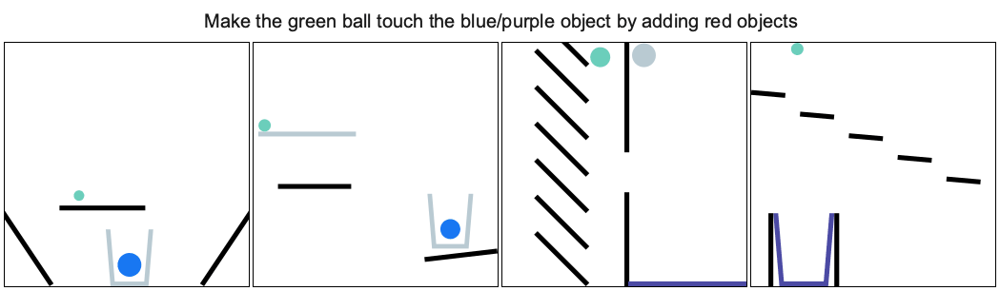

# Phyre

This project based on the Phyre framework [](https://github.com/facebookresearch/phyre). It provides a variety of physics puzzles in a simulated 2D world.ch puzzle
has a goal state (e.g., *make the green ball touch the blue wall*) and an initial state in which the goal is not satisfied (see the figure below). A puzzle can be solved by placing one or more new bodies in the environment such that when the physical simulation is run the goal is satisfied. An agent
playing this game must solve previously unseen puzzles in as few attempts as possible.\
A report of the setup and results of the project can be found here: [Phyre](report/Phyre)



## Installation
The simplest way to install PHYRE is via pip. As PHYRE requires Python version 3.6, we recommend installing PHYRE inside a virtual environment, e.g. using [Conda](https://docs.conda.io/en/latest/).

 We provide PHYRE as a pip package for both Linux and Mac OS.

```(bash)
conda create -n phyre python=3.6 && conda activate phyre
pip install phyre
```

To check that the installation was successful, run `python -m phyre.server` and open http://localhost:30303. That should start a local demo server.

For instructions on building PHYRE from source and installing in a Docker container, see [INSTALLATION](INSTALLATION.md).

## Training an agent
We provide a set of baseline agents that are described in the paper.
In order to run them, you need to install additional python dependencies with `pip install -r requirements.agents.txt`.

All the agents are located in `agents/` folder. The entry point is `train.py`
that will train an agent on specified eval setup with a specified fold.
E.g., the following command will train a memoization agent:

```(bash)
python agents/train.py \
    --output-dir=results/ball_cross_template/0 \
    --eval-setup-name=ball_cross_template \
    --fold-id=0 \
    --mem-rerank-size 100 \
    --agent-type=memoize
```

